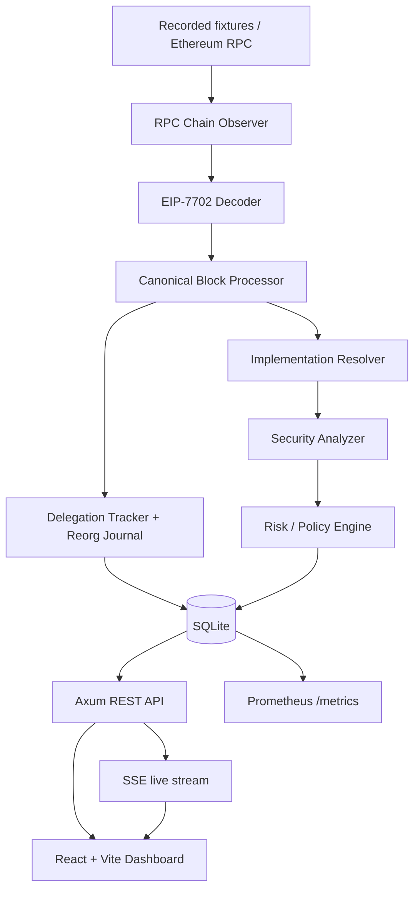
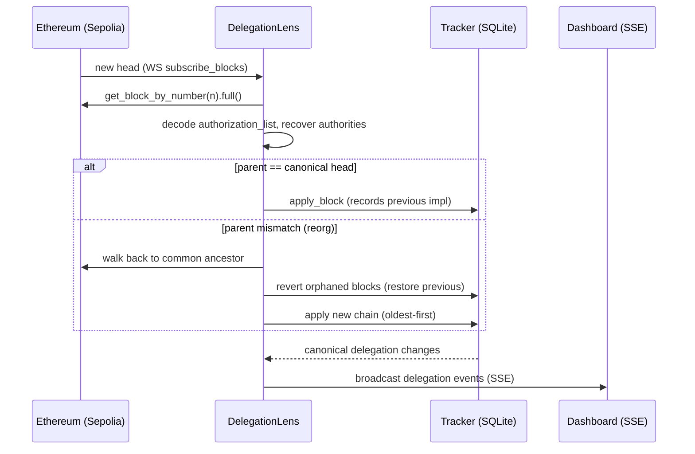

# 🔭 DelegationLens

> **Reorg-Aware EIP-7702 Delegation Intelligence & Security Analysis**
> A Rust indexer that tracks account→implementation delegations across chain reorgs, flags dangerous delegate contracts with evidence-based rules, and streams it all to a live dashboard — without ever overclaiming.

[](https://opensource.org/licenses/Apache-2.0)
[](https://www.rust-lang.org/)
[](https://book.getfoundry.sh/)
[](https://github.com/jevinjojo/Delegation-Lens/actions)
[](https://github.com/jevinjojo/Delegation-Lens/releases)

---

## 🎥 Live Demo

The full pipeline in action — broken into 4 short clips so you can jump straight to what matters.

### 1️⃣ Live Ingestion — Reorg-Safe Canonical Tracking
The backend connects to **Sepolia**, backfills to head, then follows new blocks over WebSocket. EIP-7702 authorizations are decoded, authorities recovered, and each account's canonical delegation is tracked — with per-change previous-value journaling so a reorg reverts cleanly. Startup logs show **RPC keys redacted**.


https://github.com/user-attachments/assets/c0f71dbe-fbbe-439d-9493-c9e9ddc4861b


---

### 2️⃣ Dashboard — Delegations, History & Findings, Live
A tour of the React dashboard: **Overview** counters, an **SSE live feed** where a real delegation (and a `cleared` event) appears with no refresh, **Account** drill-down with full canonical history, and **Implementation** detail showing a real security finding — evidence, severity, and a *separate* confidence — against a live-deployed vulnerable contract, plus the **Alerts** view surfacing at-risk accounts.


https://github.com/user-attachments/assets/647c477c-b934-4584-8476-3aab0d1e25e1


---

### 3️⃣ Security Analyzer — Proven with Foundry Exploits
The three detection rules (DL-001/002/003) are validated against real Solidity fixtures: each **vulnerable** contract has a working exploit (funds drained / ownership seized / signature replayed), and the **safe** counterpart rejects the identical attack. **7/7 Foundry tests pass.**


https://github.com/user-attachments/assets/3eba2264-92b6-45e2-87fb-f23b41ae13fc


---

### 4️⃣ Observability, Benchmark & CI
`/metrics` exposes live Prometheus counters and histograms; `docker compose up` brings up Prometheus (target **UP**) + Grafana. The reproducible benchmark reports **~1,400 blocks/s**, **~0.56 ms/block reorg rollback**, and **~309K analyses/s**. GitHub Actions runs green across backend, contracts, and frontend.


https://github.com/user-attachments/assets/afc6e6af-acd4-4145-98fc-a331eaba8bae


---

## 🚀 The Problem & The Solution

### The Problem
1. **EIP-7702 turns every EOA into a potential smart-contract wallet.** A delegated account runs an implementation's code *in its own context* — its storage, its balance, `address(this)` is the EOA. A flaw in that implementation (public initializer, unauthenticated `execute`, replayable signature) is not "a bug in some contract"; it is **a full takeover of every EOA that delegated to it**, and anyone can call a delegated account.
2. **Reorgs make naive indexers lie.** The chain tip reorganizes. An indexer that blindly applies every block it sees will happily report a delegation that **never happened on the canonical chain** — catastrophic for a security tool.

### The DelegationLens Solution
1. **Reorg-aware canonical tracking.** Every delegation change stores the value it overwrote, inside a DB transaction. On a reorg, DelegationLens walks back to the common ancestor, reverts orphaned blocks (restoring previous values), and applies the new chain — validated by a randomized stateful property test. Reverted history is kept, marked non-canonical, never deleted.
2. **Evidence-based analysis that refuses to overclaim.** Three rules detect the classic EIP-7702 failure classes, each with **evidence + remediation** and a **confidence that is independent of severity**. Verified source yields higher confidence; bytecode-only stays `Heuristic`. It never claims to detect all vulnerabilities or prove exploitability.

---

## ✨ Key Features

| Feature | Description |
|---|---|
| ♻️ **Reorg Engine** | Per-change previous-value journaling + atomic SQLite transactions. Walks to the common ancestor, reverts head-first, re-applies. Idempotent apply/revert. |
| 🔎 **EIP-7702 Decoder** | Decodes the authorization list, recovers each authority (secp256k1 via Alloy `k256`), handles set/clear delegation, flags invalid signatures & chain mismatches. |
| 🛡️ **Evidence-Based Analyzer** | Rules **DL-001/002/003** with evidence, severity (Informational→Critical), and a *separate* confidence (Heuristic/Probable/Confirmed). Runs automatically on every new delegation via live bytecode fetch, persisted to SQLite. Validated against safe + vulnerable fixtures. |
| 🚨 **Live Alerts** | Accounts currently delegated to a High/Critical-severity implementation, computed by joining live findings against canonical delegation state — reverted delegations drop off automatically. |
| ⚖️ **Policy-as-Code** | `config/risk-policy.yaml` defines rule weights + thresholds. Scores are fully traceable to findings; anomaly signals are kept separate from vulnerabilities. |
| 📡 **Live Dashboard** | React + Vite + SSE. Overview, live feed, account & implementation detail, reorg timeline, system health — with canonical vs reverted visibly distinct. |
| 🌐 **Stable REST API** | Axum, cursor pagination, input validation (400 not 500), OpenAPI spec, and rate limiting on expensive endpoints. |
| 📈 **Observability** | Prometheus metrics (`/metrics`), Grafana via Docker Compose, structured `tracing`, graceful shutdown, and failure isolation. |
| 🧪 **Test-First** | Deterministic fixtures, unit + integration + **stateful property tests**, and a Foundry exploit/safe suite. |
| 🔐 **Secret-Safe** | RPC URLs (with API keys) are redacted in config debug/logs — logs are publishable. |

---

## 📊 Results

Measured with `cargo run --release -- bench` (in-memory SQLite; hardware-dependent):

| Metric | Result |
|---|---|
| Block application throughput | **~1,423 blocks/s** (~4,269 authorizations/s) |
| Reorg rollback | **~0.56 ms/block** |
| Analyzer throughput | **~309,000 analyses/s** |
| Foundry exploit/safe suite | **7 / 7 passing** |
| Rust test suite | unit + integration + stateful property tests, all green |

Rule accuracy against fixtures: the **safe** delegate produces **zero** findings (no false positives), and each **vulnerable** delegate fires **exactly** its own rule (true positives, no cross-firing).

---

## 🏗️ Architecture

### Data pipeline



### Live ingestion + reorg reconciliation



---

## ⚡ Quickstart

### Prerequisites
- Rust 1.75+ (`rustup`, `cargo`)
- Node 18+ (for the dashboard)
- Foundry (`forge`) — for the security fixtures
- Docker + Docker Compose — for the observability stack
- A Sepolia RPC endpoint with HTTP and WebSocket URLs (e.g. Alchemy / Infura)

### 1. Backend + live ingestion

```bash
git clone https://github.com/jevinjojo/Delegation-Lens.git
cd Delegation-Lens
cp .env.example .env
# Edit .env:
#   RPC_HTTP_URL=https://eth-sepolia.g.alchemy.com/v2/YOUR_KEY
#   RPC_WS_URL=wss://eth-sepolia.g.alchemy.com/v2/YOUR_KEY
#   CHAIN_ID=11155111
#   START_BLOCK=<a recent Sepolia block>
cargo run                 # backfills to head, then follows the chain; API on :8080
```

### 2. Dashboard

```bash
cd apps/dashboard
npm install
npm run dev               # http://127.0.0.1:5173  (use 127.0.0.1, not localhost — CORS)
```

### 3. Full observability stack

```bash
docker compose up --build
# backend    -> http://localhost:8080
# Prometheus -> http://localhost:9090   (Status → Targets shows delegation-lens UP)
# Grafana    -> http://localhost:3000   (Explore → Prometheus → blocks_processed_total)
```

### 4. Security fixtures

```bash
cd contracts && forge test -vvv        # 7 exploit/safe tests
```

### 5. CLI & benchmark

```bash
cargo run -- inspect-file fixtures/transactions/valid_set.json   # decode an EIP-7702 tx
cargo run -- gen-fixtures                                        # regenerate signed fixtures
cargo run --release -- bench                                     # reproducible benchmark
```

### 6. API examples

```bash
curl http://127.0.0.1:8080/api/v1/stats
curl http://127.0.0.1:8080/api/v1/accounts/<address>/delegation
curl "http://127.0.0.1:8080/api/v1/accounts/<address>/history?limit=10"
curl http://127.0.0.1:8080/api/v1/accounts/bad/delegation        # -> 400 structured error
curl http://127.0.0.1:8080/api/v1/alerts
curl http://127.0.0.1:8080/api/v1/implementations/<address>/findings
curl http://127.0.0.1:8080/api/v1/changes
curl http://127.0.0.1:8080/api/v1/reorgs
curl http://127.0.0.1:8080/api/v1/openapi.yaml
curl http://127.0.0.1:8080/metrics
```

---

## 📁 Project Structure

```
delegation-lens/
├── src/
│   ├── main.rs            # CLI + server entrypoint (serve / inspect-file / gen-fixtures / bench)
│   ├── config.rs          # env config + secret redaction
│   ├── domain.rs          # BlockRef, Authorization, DelegationChange, ChainUpdate + DTOs
│   ├── error.rs           # typed AppError -> structured HTTP responses
│   ├── telemetry.rs       # tracing + Prometheus recorder
│   ├── source.rs          # EIP-7702 decoder, fixtures, live RPC ingestion (Alloy)
│   ├── chain.rs           # canonical block processor + reorg reconciliation + retry/backoff
│   ├── tracker.rs         # delegation tracker + reorg journal (apply / revert)
│   ├── analyzer.rs        # evidence-based analyzer (DL-001/002/003) + analysis job status
│   ├── policy.rs          # risk scoring, anomaly signals, alert lifecycle
│   ├── storage.rs         # SQLite (SQLx) read/write queries
│   ├── api.rs             # Axum REST API + SSE + pagination + rate limiting
│   └── bench.rs           # reproducible benchmark
├── migrations/            # blocks, delegation_changes, current_delegations, reorg_events, delegations, implementations, findings
├── config/risk-policy.yaml
├── fixtures/transactions/ # recorded EIP-7702 transaction fixtures (+ .expected.json)
├── contracts/             # Foundry security fixtures
│   ├── src/               # SafeDelegate, UnsafeInitDelegate, OpenExecuteDelegate, ReplayableDelegate
│   └── test/Fixtures.t.sol
├── apps/dashboard/        # React + Vite + TypeScript live dashboard
│   └── src/               # App.tsx, api.ts, hooks.ts, styles.css, main.tsx
├── ops/                   # prometheus.yml + grafana provisioning
├── docs/                  # architecture, eip-7702-mechanics, detection-rules, reorg-model, threat-model
├── .github/workflows/ci.yml
├── Dockerfile
├── docker-compose.yml
├── Cargo.toml
├── PLAN.md
├── V2_BACKLOG.md
├── NOTICE
├── LICENSE
└── README.md
```

---

## 🔒 Security Posture (TL;DR)

- **Reorg correctness is not optional.** Every mutation is DB-transactional; a failed block is never partially applied. Reorg revert/restore is validated by a randomized stateful property test.
- **No overclaiming.** Severity and confidence are separate; bytecode-only findings are `Heuristic`; the analyzer never claims to detect all vulnerabilities or prove exploitability.
- **Secret redaction.** RPC URLs (which embed API keys) are redacted by a hand-written `Debug` impl before ever reaching logs — logs are publishable.
- **Resilient ingestion.** Retry with exponential backoff; RPC failures are logged and skipped, never fatal; one analysis failure never stops ingestion (explicit job statuses).
- **API hardening.** Input validation (addresses/hashes) → 400 not 500; cursor pagination with clamped limits; rate limiting on expensive endpoints; reorg depth capped.
- **Graceful shutdown.** On signal: stop new work, finish the current block, flush + close the DB pool; the last canonical block is the resume checkpoint.

Full details in [`docs/threat-model.md`](./docs/threat-model.md).

---

## 🛠️ Tech Stack

| Layer | Tools |
|---|---|
| **Backend** | Rust, Tokio, Axum, Alloy, SQLx + SQLite, Serde, thiserror |
| **Blockchain** | Alloy (providers, pubsub/WS, EIP-7702 k256 recovery), Foundry (`forge`) |
| **Security fixtures** | Solidity, Foundry cheatcodes (`vm.signAndAttachDelegation`) |
| **Dashboard** | React, TypeScript, Vite, Server-Sent Events |
| **Observability** | `tracing`, `metrics` + `metrics-exporter-prometheus`, Prometheus, Grafana |
| **Infra / CI** | Docker, Docker Compose, GitHub Actions |

---

## 🗺️ Roadmap

- [ ] reth ExEx integration (native execution-extension indexing)
- [ ] Multi-chain operational indexing
- [ ] Mainnet historical backfill
- [ ] Deeper analysis (bytecode decompilation / selective symbolic execution)
- [ ] Grafana dashboards shipped as provisioned JSON
- [ ] Team accounts / RBAC / multi-tenant

See [`V2_BACKLOG.md`](./V2_BACKLOG.md) for the full backlog and explicit out-of-scope items.

---

## 🤝 Contributing

Contributions are welcome — please open an issue first to discuss any major change.

For security vulnerabilities, **do not open a public issue**; see [`docs/threat-model.md`](./docs/threat-model.md) for the model and responsible disclosure.

---

## 📄 License

Apache License 2.0 — see [LICENSE](./LICENSE).

---

## 👤 Author

Built by **[Jevin Jojo](https://github.com/jevinjojo)**.

---

*DelegationLens: because on EIP-7702, the implementation your account points to is the implementation that controls your account.*
